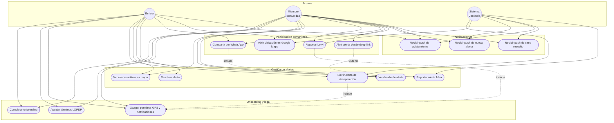

# Diagrama de casos de uso — Centinela

Actores y funcionalidades del MVP.

---

## Descripción de casos de uso

| ID | Caso de uso | Actor | Descripción |
|----|-------------|-------|-------------|
| UC-01 | Emitir alerta | Emisor | Sube foto, datos y ubicación; notifica usuarios en radio |
| UC-02 | Ver alertas activas | Ambos | Mapa + lista ordenada por distancia en tiempo real |
| UC-03 | Reportar Lo vi | Comunidad | Marca ubicación y nota; notifica al emisor sin exponer teléfono |
| UC-04 | Compartir WhatsApp | Ambos | Mensaje con Open Graph y deep link `centinela://` |
| UC-05 | Resolver alerta | Emisor | Cierra el caso y notifica a la comunidad en radio |
| UC-06 | Reportar falsa alarma | Comunidad | 3+ reportes marcan la alerta como `FALSA_ALARMA` |
| UC-07 | Recibir push | Comunidad/Emisor | FCM según evento: nueva alerta, avistamiento o resuelto |

---

## Requisitos funcionales vinculados

| RF | Casos de uso |
|----|--------------|
| RF-01 Emitir &lt; 20 s | UC-04 |
| RF-02 Push &lt; 10 s | UC-13, UC-14, UC-15 |
| RF-03 Lo vi sin teléfono | UC-09 |
| RF-04 WhatsApp con OG | UC-10 |

[← Índice](README.md)
