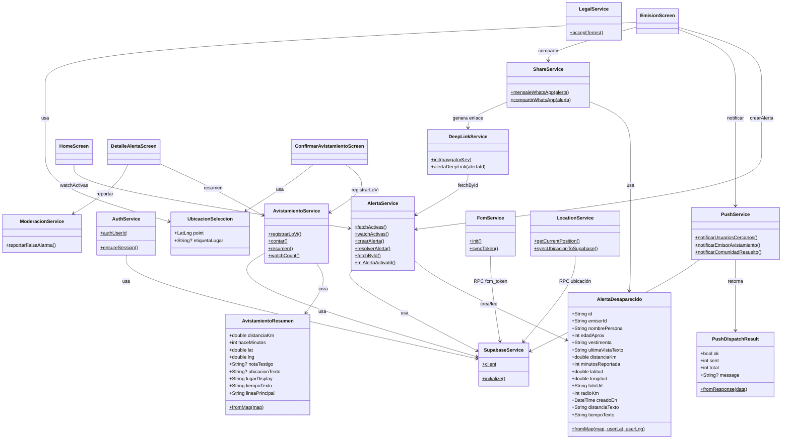

# Diagrama de clases — Centinela

Modelo de dominio y capa de servicios de la app Flutter.

---

## Notas de diseño

- **Servicios** usan patrón singleton estático (`ClassName._()`).
- **Lógica de negocio crítica** vive en RPCs Postgres (`crear_alerta_desaparecido`, `registrar_avistamiento`, etc.), no en Dart.
- **Pantallas** son clientes delgados que orquestan servicios.
- **Modelos** son inmutables con factories `fromMap` para deserializar respuestas Supabase.

[← Índice](README.md)
