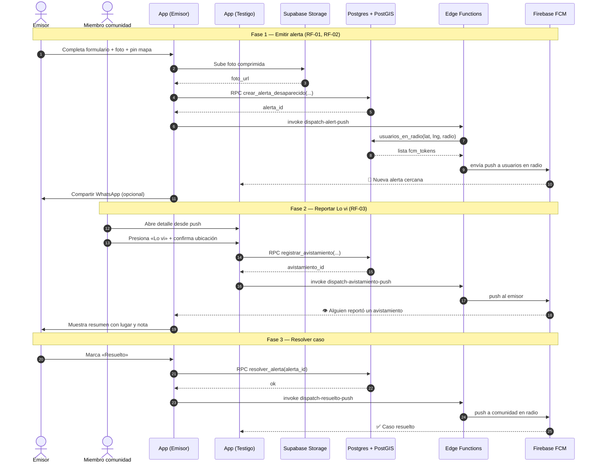
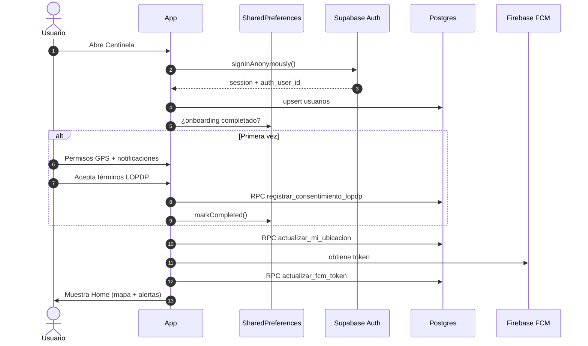

# Diagrama de secuencia (tiempo) — Centinela

Flujo completo: **emitir alerta → push comunitario → Lo vi → push al emisor → resolver**.

---

## Diagrama de secuencia — Onboarding y arranque

---

## Tiempos objetivo (SLA MVP)

| Paso | Objetivo |
|------|----------|
| Emitir alerta (4G) | &lt; 20 s (RF-01) |
| Push a radio | &lt; 10 s (RF-02) |
| Sync ubicación | cada ~3 min en Home |
| Realtime alertas | inmediato vía Postgres changes |

[← Índice](README.md)
