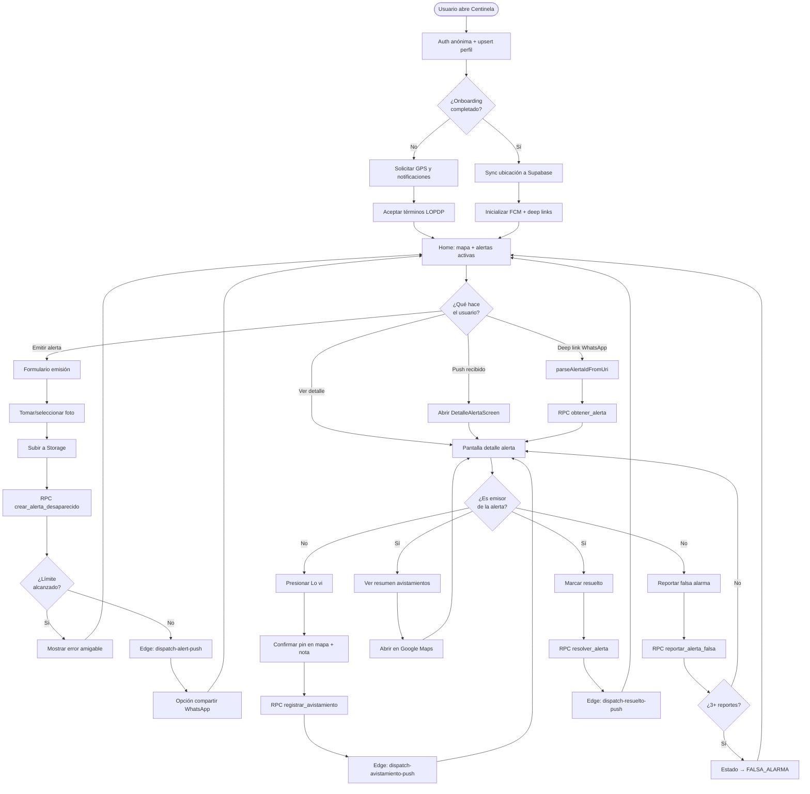
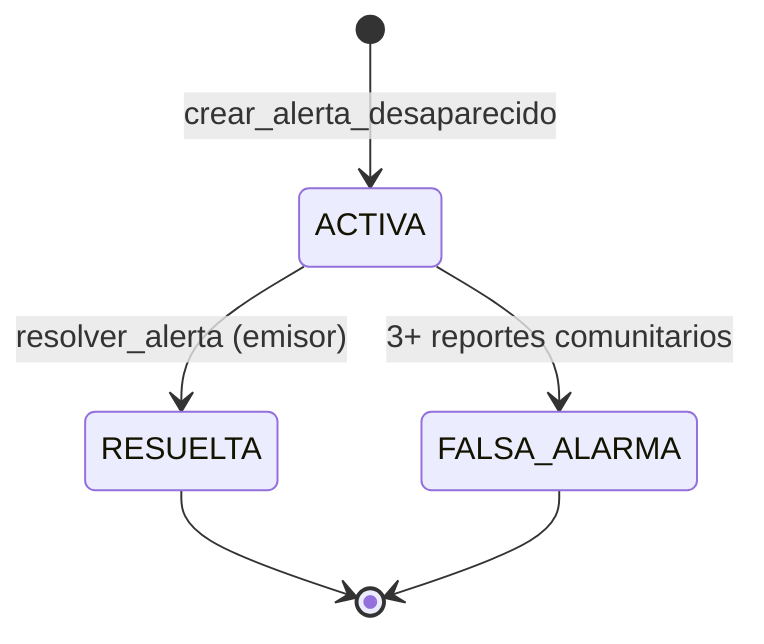

# Diagrama de actividad — Centinela

Flujo de decisión desde el arranque de la app hasta la resolución de un caso.

```mermaid
flowchart TD
    Start([Usuario abre Centinela]) --> Auth[Auth anónima + upsert perfil]
    Auth --> Onb{¿Onboarding<br/>completado?}

    Onb -->|No| Perms[Solicitar GPS y notificaciones]
    Perms --> Legal[Aceptar términos LOPDP]
    Legal --> Home

    Onb -->|Sí| SyncUbic[Sync ubicación a Supabase]
    SyncUbic --> InitFCM[Inicializar FCM + deep links]
    InitFCM --> Home[Home: mapa + alertas activas]

    Home --> Accion{¿Qué hace<br/>el usuario?}

    Accion -->|Emitir alerta| Form[Formulario emisión]
    Form --> Foto[Tomar/seleccionar foto]
    Foto --> Upload[Subir a Storage]
    Upload --> Crear[RPC crear_alerta_desaparecido]
    Crear --> Limite{¿Límite<br/>alcanzado?}
    Limite -->|Sí| ErrorLim[Mostrar error amigable]
    ErrorLim --> Home
    Limite -->|No| PushAlert[Edge: dispatch-alert-push]
    PushAlert --> ShareWA[Opción compartir WhatsApp]
    ShareWA --> Home

    Accion -->|Ver detalle| Detalle[Pantalla detalle alerta]
    Detalle --> Rol{¿Es emisor<br/>de la alerta?}

    Rol -->|No| LoVi[Presionar Lo vi]
    LoVi --> PinMap[Confirmar pin en mapa + nota]
    PinMap --> RegAv[RPC registrar_avistamiento]
    RegAv --> PushAv[Edge: dispatch-avistamiento-push]
    PushAv --> Detalle

    Rol -->|No| Reportar[Reportar falsa alarma]
    Reportar --> RPCRep[RPC reportar_alerta_falsa]
    RPCRep --> Mod{¿3+ reportes?}
    Mod -->|Sí| Falsa[Estado → FALSA_ALARMA]
    Mod -->|No| Detalle
    Falsa --> Home

    Rol -->|Sí| VerAv[Ver resumen avistamientos]
    VerAv --> Maps[Abrir en Google Maps]
    Maps --> Detalle
    Rol -->|Sí| Resolver[Marcar resuelto]
    Resolver --> RPCRes[RPC resolver_alerta]
    RPCRes --> PushRes[Edge: dispatch-resuelto-push]
    PushRes --> Home

    Accion -->|Push recibido| OpenPush[Abrir DetalleAlertaScreen]
    OpenPush --> Detalle

    Accion -->|Deep link WhatsApp| DeepLink[parseAlertaIdFromUri]
    DeepLink --> FetchAlert[RPC obtener_alerta]
    FetchAlert --> Detalle
```

---

## Estados de una alerta

```mermaid
stateDiagram-v2
    [*] --> ACTIVA : crear_alerta_desaparecido
    ACTIVA --> RESUELTA : resolver_alerta (emisor)
    ACTIVA --> FALSA_ALARMA : 3+ reportes comunitarios
    RESUELTA --> [*]
    FALSA_ALARMA --> [*]
```

[← Índice](README.md)
