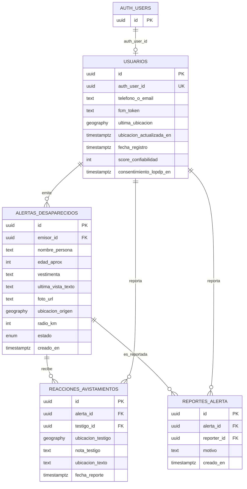

# Diagrama entidad-relación — Centinela

Esquema de base de datos en Supabase (`centinela-mvp`) con PostGIS.

---

## Vista y tipos

| Elemento | Descripción |
|----------|-------------|
| `estado_alerta` | ENUM: `ACTIVA`, `RESUELTA`, `FALSA_ALARMA` |
| `v_alertas_activas` | Vista con `lat`/`lng` extraídos de `ubicacion_origen` |
| `centinela-fotos` | Bucket Storage: lectura pública, escritura por `auth.uid()` |

---

## RPCs principales

| Función | Propósito |
|---------|-----------|
| `crear_alerta_desaparecido` | Crear alerta con límites de rate |
| `registrar_avistamiento` | Insertar «Lo vi» (único por testigo) |
| `resolver_alerta` | Cambiar estado a RESUELTA |
| `reportar_alerta_falsa` | Moderación comunitaria |
| `usuarios_en_radio` | Geofencing para FCM |
| `actualizar_mi_ubicacion` | Sync GPS del dispositivo |
| `actualizar_fcm_token` | Sync token push |
| `obtener_alerta` | Deep links y navegación |

---

## Índices espaciales

- `idx_usuarios_ultima_ubicacion` — GIST en `ultima_ubicacion`
- `idx_alertas_ubicacion_origen` — GIST en `ubicacion_origen`

[← Índice](README.md)
