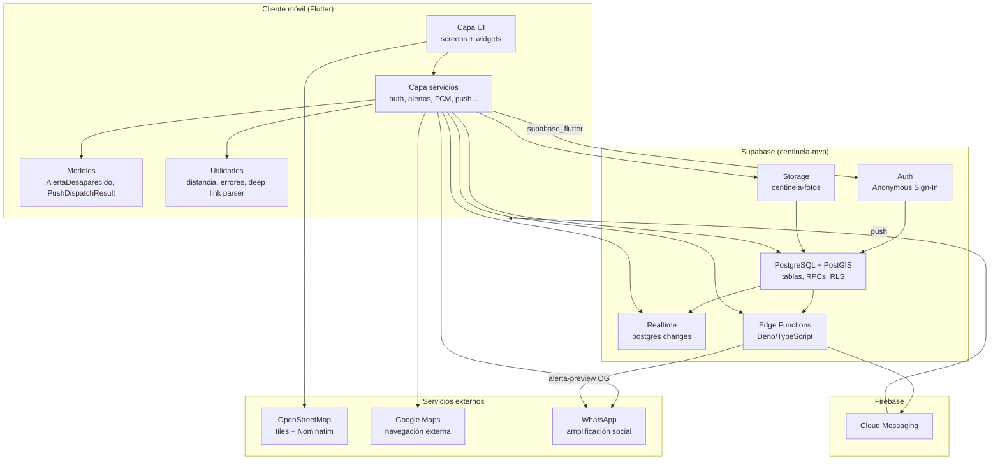

# Diagrama de componentes — Centinela

Arquitectura lógica por capas.

---

## Responsabilidades por componente

| Componente | Responsabilidad |
|------------|-----------------|
| **UI (screens/widgets)** | Presentación, navegación, permisos |
| **Services** | Orquestación, llamadas RPC, streams Realtime |
| **Postgres RPCs** | Reglas de negocio, límites, geo-queries |
| **Edge Functions** | Push FCM, preview Open Graph |
| **RLS** | Seguridad por fila (auth.uid()) |
| **Storage** | Fotos comprimidas (&lt;280 KB para OG) |

---

## Dependencias clave (pubspec.yaml)

| Paquete | Uso |
|---------|-----|
| `supabase_flutter` | Cliente backend |
| `firebase_messaging` | Push notifications |
| `flutter_map` + `latlong2` | Mapa en app |
| `geolocator` | GPS |
| `app_links` | Deep links |
| `url_launcher` | WhatsApp, Google Maps |

[← Índice](README.md)
