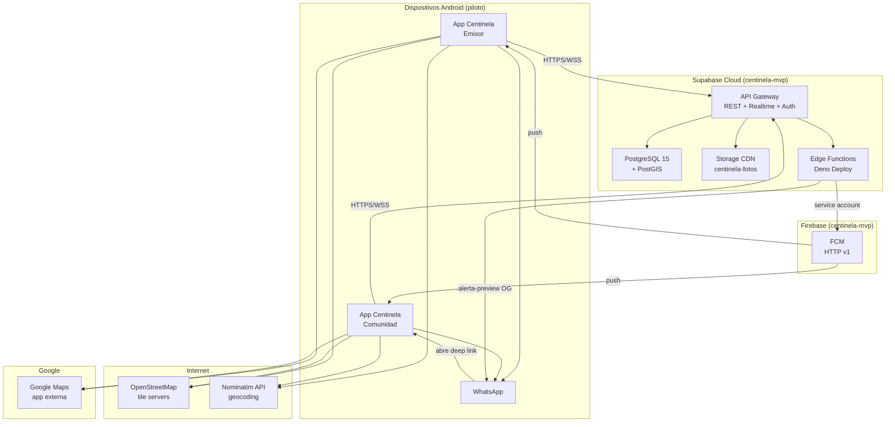

# Diagrama de despliegue — Centinela

Distribución física del sistema en el piloto Jipijapa.

---

## Artefactos de despliegue

| Artefacto | Ubicación | Cómo se despliega |
|-----------|-----------|-------------------|
| APK release | `build/app/outputs/flutter-apk/app-release.apk` | `./scripts/build_apk.sh` |
| Migraciones SQL | `supabase/migrations/` | Dashboard Supabase o `supabase db push` |
| Edge Functions | `supabase/functions/` | `supabase functions deploy` |
| Variables FCM | Secrets Supabase | `FIREBASE_SERVICE_ACCOUNT` |
| Env local | `env/app.env` | `./scripts/setup_env.sh` (no commitear) |
| Firebase config | `android/app/google-services.json` | Firebase Console (gitignored) |

---

## Entornos

| Entorno | Estado | Notas |
|---------|--------|-------|
| **Producción piloto** | Activo | Supabase `centinela-mvp`, APK sideload |
| **Local dev** | Parcial | Flutter local + Supabase remoto (sin `config.toml`) |
| **Play Store** | Planificado | Testing cerrado Jipijapa |
| **iOS / Web** | Scaffold | No es foco del piloto |

---

## Regla de aislamiento

> **Nunca desplegar en el Supabase de RECI.** Proyecto dedicado: `centinela-mvp` · ref `wziwufumjtpjqyuzzzyn`

[← Índice](README.md)
