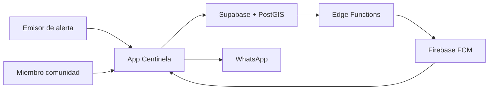

# Diagramas — Proyecto Centinela

Diagramas UML y de arquitectura del MVP. Todos usan **Mermaid** (se renderizan en GitHub, VS Code y Cursor).

| # | Diagrama | Archivo |
|---|----------|---------|
| 1 | Casos de uso | [01-caso-de-uso.md](01-caso-de-uso.md) |
| 2 | Clases | [02-clases.md](02-clases.md) |
| 3 | Objetos | [03-objetos.md](03-objetos.md) |
| 4 | Secuencia (tiempo) | [04-secuencia.md](04-secuencia.md) |
| 5 | Actividad | [05-actividad.md](05-actividad.md) |
| 6 | Entidad-relación | [06-entidad-relacion.md](06-entidad-relacion.md) |
| 7 | Componentes | [07-componentes.md](07-componentes.md) |
| 8 | Despliegue | [08-despliegue.md](08-despliegue.md) |

---

## Vista rápida del sistema

---

## Actores principales

| Actor | Rol |
|-------|-----|
| **Emisor** | Persona que reporta un desaparecido y gestiona su alerta |
| **Miembro comunidad** | Usuario que recibe alertas, reporta avistamientos o amplifica |
| **Sistema Centinela** | App + Supabase + Edge Functions + FCM |

---

## Referencias

- Código: `lib/`, `supabase/`
- Requerimientos: [ProyectoPersonalSeguridad.docx](../ProyectoPersonalSeguridad.docx)
- SDD: [Documento de Diseño del Sistema (SDD)](../Documento%20de%20Dise%C3%B1o%20del%20Sistema%20(SDD)%20-%20Proyecto%20Centinela.docx)
- Estado: [Estado-Proyecto.md](../Estado-Proyecto.md)
